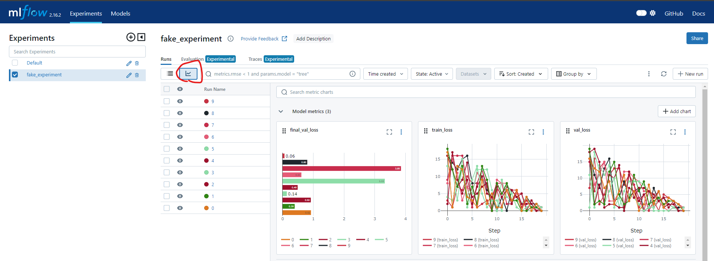

# MLflow Logging Example

This project demonstrates how to use MLflow to log metrics and hyperparameters to a local MLflow server. It includes a script that simulates model training and logs the results to MLflow, allowing you to track and visualize metrics such as training loss, validation loss, and hyperparameters for multiple runs.

## Installation

### Step 1: Create the Conda Environment

The project environment can be set up using Conda. Run the following command to create the environment:

```bash
conda env create -f _config/environment.yml
```

### Step 2: Activate the Environment

Once the environment is created, activate it with:

```bash
conda activate local-ml-flow
```

## Usage

### Step 1: Run basic example to log fake data to MLflow

With the MLflow server running, execute the script to simulate model training and log metrics to MLflow:

```bash
python local_only_ml_flow.py
```

### Step 2: Start the MLflow Server

Start the MLflow server locally. You can do this by running:

```bash
mlflow ui --backend-store-uri mlflow_data_storage
```
This command will start a server that you can view in your browser by navigating to `http://127.0.0.1:5000`.  You can view the metrics and hyperparameters logged by the script in the MLflow UI.

### Step 3: View the Results of the multiple runs

Click on this button to view the metrics progress over time for the multiple runs:


